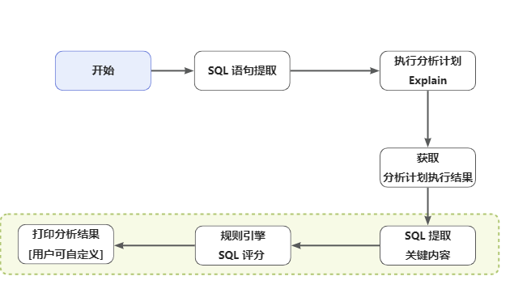
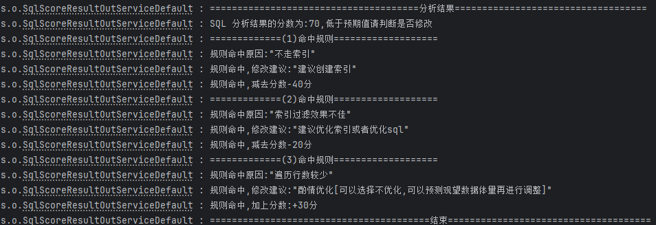

<p align="center">
    <a href="" target="_blank">
      
    </a>
</p>
<h1 align="center">SQL 慢镜 - SQLSlowMirror</h1>
<p align="center"><strong>一个旨在帮助系统快速分析慢 SQL 的工具。<br>无论你是开发者还是运维人员，SQL 慢镜都将成为你的最佳伙伴。<em>持续更新中～</em></strong></p>
<div align="center">
    <a href=""></a>
    <a href=""></a>
</div>


## 背景

大促备战，最大的隐患项之一就是慢 SQL，带来的破坏性最大，也是日常工作中经常带来整个应用抖动的最大隐患，而且对 SQL 好坏的评估有一定的技术要求，有一些缺乏经验或者因为不够仔细造成一个坏的 SQL 成功走到了线上，等发现的时候要么是造成了线上影响、报警、或者后置的慢 SQL 采集发现，这时候一般无法快速止损，需要修改代码上线、或者调整数据库索引。

1、无法提前发现慢 SQL，可能恶化为慢 SQL 的语句

2、线上出现慢 SQL 后，无法快速止损


项目参考了京东开源项目：**[sql-analysis](https://github.com/jd-opensource/sql-analysis)**


## 功能&设计🚀



```txt
sql-slow-mirror-core SQL 慢镜组件核心代码
├─analysis	--SQL执行分析模块
├─config	--配置文件的存放
├─core	--负责组件的接入到 mybatis 以及流程调用
├─extract	--负责完整 SQL 的提取模块
├─out	--输出结果模块
├─rule	--规则引擎执行模块
├─utils	--工具类存放模块
└─score	--评分模块

sql-slow-mirror-sample --[示例]示例 demo 可直接使用
```

### 功能：

1. 对 Mybatis 中的执行 SQL 解析
2. 分析 SQL 的执行计划
3. 通过规则引擎将执行计划进行解析并输出

## 快速开始🌈

### 启动示例

**方式一**：使用本项目中的测试用例

1. 将项目克隆到本地

   ```
   git clone https://github.com/lhccong/sql-slow-mirror
   ```

2. IDEA打开项目

   使用 IDEA 打开，等待项目初始化完成。

3. 执行 sql-analysis-samples 项目中的测试用例，查看控制台输出的分析日志




### 使用方法

#### 1、引入依赖

```xml
<dependency>
    <groupId>com.cong.sql.slow.mirror</groupId>
    <artifactId>sql-slow-mirror-core</artifactId>
    <version>1.0-SNAPSHOT</version>
</dependency>
```

#### 2、配置 yml

```yml
spring:
  datasource:
    driver-class-name: com.mysql.cj.jdbc.Driver
    url: jdbc:mysql://localhost:3306/需要分析的数据库?useSSL=false&useUnicode=true&characterEncoding=utf-8&serverTimezone=Asia/Shanghai&allowPublicKeyRetrieval=true
    username: root
    password: root
sql:
   slow:
      mirror:
         analysisSwitch: true #是否开启 SQL 分析
#         onlyCheckOnce: true  #是否只分析一次
#         checkInterval: 300000  #分析间隔 只有 onlyCheckOnce 为 false 的时候才有效
#         exceptSqlIds: com.cong.example.mapper.TaskMapper.selectList,com.cong.example.mapper.TaskMapper.xxx #不需要分析的 SQL ID
#         sqlType: SELECT,UPDATE #拦截的 SQL 类型
#         outModel: LOG #日志模型 默认就是系统的 log 打印
#         outputClass: com.cong.example.out.MySqlScoreResultOutService #要自定义输出的时候再打开
```

|                |                                            |          |                    |                             |
| -------------- | ------------------------------------------ | -------- | ------------------ | --------------------------- |
| 属性           | 用途                                       | 是否必填 | 默认值             | 备注                        |
| analysisSwitch | 是否开启分析功能                           | 是       | false              |                             |
| onlyCheckOnce  | 是否对一个sqlid只分析一次                  | 非       | true               |                             |
| checkInterval  | 每个sqlid分析间隔                          | 非       | 300000毫秒         | onlyCheckOnce 为false才生效 |
| exceptSqlIds   | 需要过滤不分析的sqlid                      | 非       |                    |                             |
| sqlType        | 分析的sql类型                              | 非       | 默认 SELECT,UPDATE |                             |
| outModel       | 默认输出方式                               | 非       | 默认值：LOG        |                             |
| outputClass    | 评分结果输出类，用于扩展自定义结果输出方式 | 非       |                    |                             |

#### 3、注入容器

```java
package com.cong.example.config;

import com.cong.sql.slowmirror.config.ConfigUtils;
import com.cong.sql.slowmirror.core.SqlAnalysisAspect;
import org.mybatis.spring.annotation.MapperScan;
import org.springframework.context.annotation.Bean;
import org.springframework.context.annotation.Configuration;

import java.util.Properties;

/**
 * MyBatis Plus 配置
 *
 * @author <a href="https://github.com/lhccong">...</a>
 */
@Configuration
@MapperScan("com.cong.example.mapper")
public class MyBatisPlusConfig {

    /**
     * SQL分析方面
     *
     * @return {@link SqlAnalysisAspect}
     */
    @Bean
    public SqlAnalysisAspect sqlAnalysisAspect() {

        // 加载配置文件，此处加载的是名为"sql.slow.mirror"的配置
        Properties properties = ConfigUtils.loadConfig("sql.slow.mirror");

        // 创建SQL分析切面的实例
        SqlAnalysisAspect sqlAnalysisAspect = new SqlAnalysisAspect();

        // 将加载的配置属性设置到SQL分析切面实例中
        sqlAnalysisAspect.setProperties(properties);

        // 返回配置完毕的SQL分析切面实例
        return sqlAnalysisAspect;
    }


```

## 优势

1. 接入成本低：只需要设置好配置文件
2. 可扩展性好：能够通过自定义的方式来制定分析结果的输出
3. 性能：基于性能和不同的使用场景考虑，支持定制化配置，每个 SQL 是否仅进行一次检查、或者按某个时间间隔进行配置

### 贡献者

- [聪](https://github.com/lhccong) - 主要开发者

### 许可证

该项目采用 MIT 许可证。详细信息请参阅 [LICENSE](LICENSE) 文件。

### 联系方式

如有任何疑问或建议，欢迎联系项目主要开发者：

- 电子邮件: 771901874@qq.com

### 注意事项

- 本项目仅供学习和参考使用，未经授权请勿用于商业目的。
- 欢迎贡献代码或者提出建议，您可以通过提出 Issue 或者 Pull Request 的方式参与到项目中来。

## 参与贡献

如果您对项目有任何建议或想要贡献代码，欢迎提交 Issue 或 Pull Request。我们期待您的参与，共同完善和改进 SQL 慢镜项目！

---

感谢您对 SQL 慢镜项目的关注和支持！🕵️‍♀️